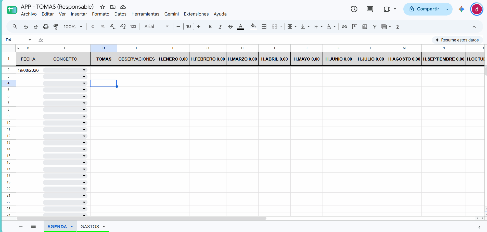
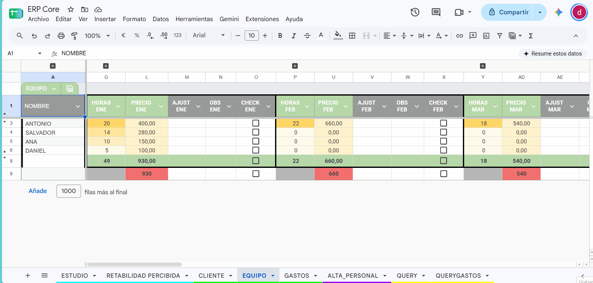

# Workspace-ERP-System

A complete, decentralized, and automated ERP (Enterprise Resource Planning) system built entirely on the Google Workspace ecosystem.

This project was born from the need to go beyond traditional spreadsheets, transforming them into a real business management application. It combines simulated relational databases, automation through Google Apps Script, and custom Business Intelligence algorithms to optimize billing, client tracking, and team profitability.

### 💡 Key Highlights
* **Automated Billing:** Generation of PDF invoices with dynamic tax calculation (VAT/Income Tax) via Apps Script.
* **Decentralized Architecture:** Individual data entry nodes for workers, synced in real-time with a central Dashboard.
* **Integrated Business Intelligence:** Custom algorithm to calculate and visualize the real performance and profitability of each client account.

---

### ⚙️ Data Architecture & Workflow

To ensure data integrity and allow simultaneous access by multiple users without compromising the master file, the system is designed under a distributed node architecture:

* **Decentralized Entry Nodes:** Employees and managers log their hours or expenses in individual spreadsheets (separate instances). This acts as a data collection *frontend* that isolates and protects the business logic from the central Dashboard.
* **Dynamic Synchronization (`IMPORTRANGE`):** The system maintains two-way, real-time communication. The master file feeds active data to peripheral nodes (e.g., the client dropdown menu). If a client is deactivated in the central panel, their access is instantly revoked across all worker sheets, ensuring global consistency.
* **Real-Time Data Flow:** Data entered by employees in their isolated environments instantly cascades into the central ERP engine and financial dashboards without manual refreshing.

> 

* **Relational Database Emulation (SQL Views):** Using tabs configured with the QUERY formula, the system processes, filters, and "flattens" consolidated information regarding clients, team, and expenses. This approach mimics the behavior of "Views" in traditional relational databases, optimizing search performance and leaving the structure ready for future mobile interface integrations.

---

### 📊 Core Features (Main Modules)

The system is divided into independent modules that communicate with each other to provide a 360º view of the business:

#### 1. Automated Billing Engine (Sales Pipeline)
A central dashboard manages contractual conditions (Tax ID, % VAT, % Income Tax, monthly or hourly billing model).
* **One-Click PDF Generation:** Using a custom Google Apps Script, the system automatically detects the active month, calculates tax bases and taxes, and generates the final PDF invoice, saving it directly to a Google Drive folder.
* **Visual Alerts:** Implementation of heatmaps (color scales) to quickly identify high-volume billing clients and alert systems for pending payments.

> 

#### 2. Business Intelligence: Perceived Profitability
Beyond just adding up revenue, the system evaluates the quality of effort. It uses a custom algorithm to calculate which clients are truly the most profitable.
* **Algorithmic Formula:** The mathematical formula `(Revenue / Hours Worked)^1.2` is applied to weight and reward efficiency. This automatically generates a heatmap that enables strategic decisions on which accounts to keep, renegotiate, or drop.

>   

#### 3. Financial Analytics (Studio Dashboard)
A performance dashboard that automatically cross-references revenue (inflows) and expenses (outflows/payments) to calculate real cash flow. It incorporates a margin control system that automatically differentiates between internal operational expenses and purchases rebilled to clients, calculating the true net profit.
* **Month-over-Month (MoM) Growth:** Automatic monitoring of the percentage variance (*Month-over-Month*) in both client retention/acquisition and net profit, facilitating the detection of short and long-term trends.
* **Data Visualization:** Dynamic bar charts displaying the profit balance and operating margin, providing an instant financial overview.

> 

#### 4. HR Management and Client Control (SLAs)
The system features monthly configuration panels with a clean interface based on grouped columns, allowing variable adjustments without visually overwhelming the user.
* **Hybrid Client Control:** Individualized configuration of the billing model (fixed monthly fee, hourly rate, or mixed model). Includes an alert system that automatically notifies when agreed-upon hour limits (SLAs) are exceeded.
* **Payroll Engine:** The team module automatically calculates worker compensation using advanced conditional formulas. The algorithm detects the contracted hours threshold (base rate) and automatically transitions to the overtime rate after the limit is reached, evaluating data pulled in real-time from individual sheets.

> 

#### 5. Operational Expense Control
* **Automated Classification:** Purchase management using concepts and pivot tables that summarize capital outflows in real-time, allowing an at-a-glance audit of spending areas.

#### 6. Automated Employee Provisioning (Onboarding)
A custom frontend form that triggers a complex Apps Script sequence to securely onboard new workers in seconds.
* **Zero-Touch Provisioning:** The script validates inputs, duplicates template files, assigns user variables, and structures the specific `IMPORTRANGE` links for the new employee.
* **Dynamic SQL Injection:** The backend engine automatically locates and safely rewrites the master `QUERY` formulas in the core database to include the new employee's data streams, ensuring the ecosystem updates autonomously without breaking existing financial structures.

> 

---

### 💻 Automation Logic (Apps Script)

The core of the system is powered by advanced JavaScript code integrated into the Workspace environment.

**Dynamic Matrix Injection:**
The onboarding script is capable of reading active spreadsheet formulas, injecting new data array arguments, and deploying them to update the ecosystem on the fly.

```javascript
// Example: Dynamic SQL injection to update Central ERP Queries
var formQuery = celdaQuery.getFormula();
if (formQuery !== "") {
  // Automatically injects the new employee's tab into the master array
  var nuevaFormQuery = formQuery.replace("};", "; '" + nombrePestañaHoras + "'!A2:E};");
  celdaQuery.setFormula(nuevaFormQuery);
}
```

**Dynamic Billing Engine:**
The engine calculates dynamic column shifts to process billing for any month of the year using a single mathematical function:

```javascript
// Example of the dynamic month detection engine for billing
if (columna >= 13 && (columna - 13) % 10 === 0) { 
  const meses = ["ENERO", "FEBRERO", "MARZO", "ABRIL", "MAYO", "JUNIO", "JULIO", "AGOSTO", "SEPTIEMBRE", "OCTUBRE", "NOVIEMBRE", "DICIEMBRE"];
  const indiceMes = (columna - 13) / 10; 
  
  if (indiceMes < 12) {
    crearFacturaDinamica(fila, meses[indiceMes], indiceMes);
    e.range.setValue(false); // Automatic interface reset
  }
}
```
### 🚀 Scalability & Future Roadmap

Thanks to the flattened and centralized data structure via `QUERY` functions, the system's core acts as a robust backend ready to be decoupled from the spreadsheet interface. Next scalability steps include:

* **Mobile Frontend (AppSheet):** Transition from spreadsheet-based entry nodes to a native mobile app. This will allow workers to log hours and capture expense receipts directly from their phones, injecting data into the ERP in real-time.
* **Executive Dashboards (Looker Studio):** Connecting the master Dashboard to interactive Looker Studio panels. This will provide managers and executives with advanced graphical visualization of financial status and profitability, without needing access to the database engine.
* **API Integration (Tax Compliance):** Evolving the billing engine to act as a data pre-processor. The system prepares the tax base and business logic to export structured payloads (JSON) to certified external billing gateways, ensuring regulatory compliance (e.g., VeriFactu in Spain) through proper separation of concerns.
