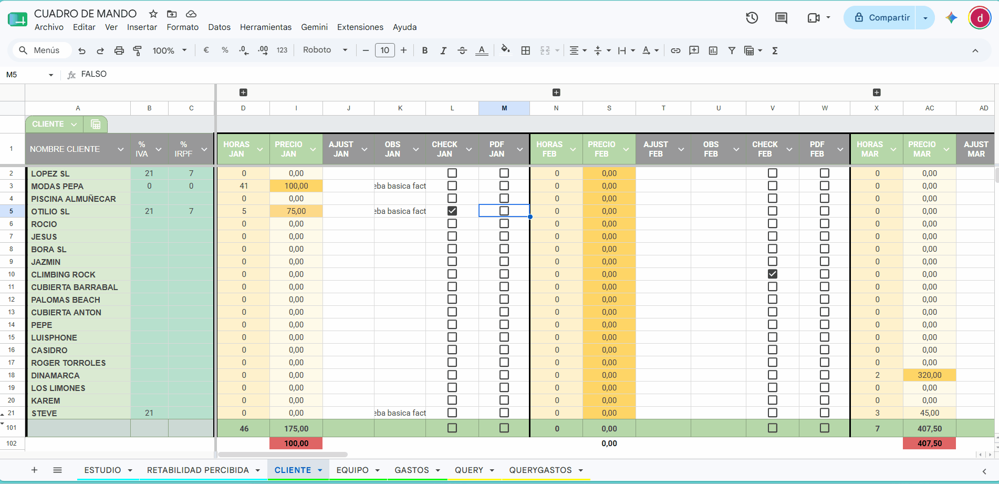
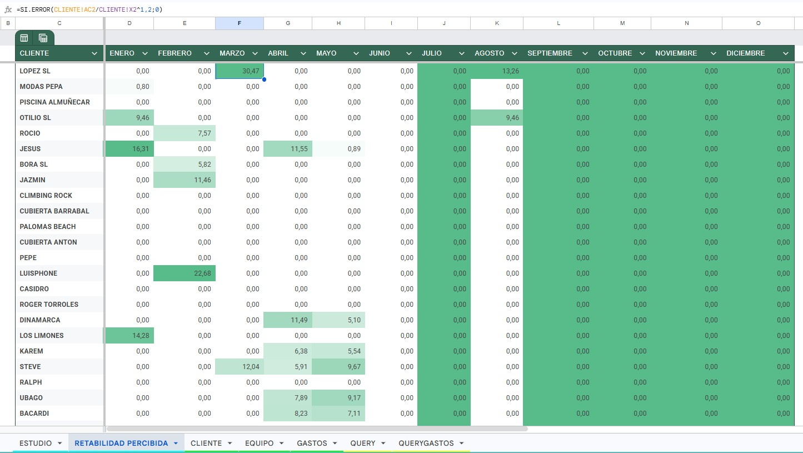
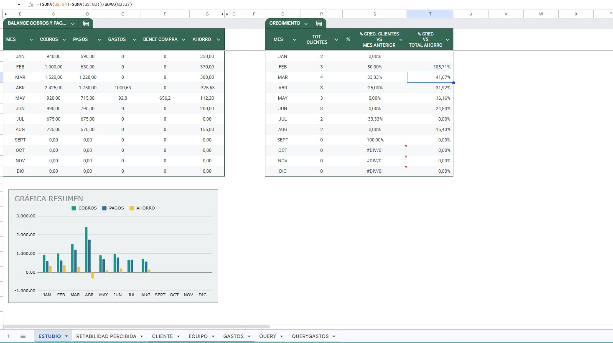
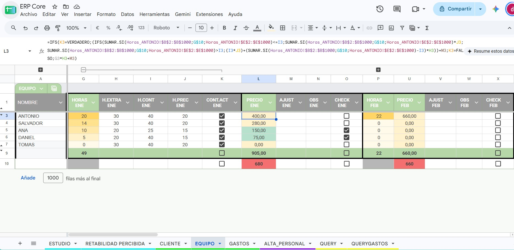

# Workspace-ERP-System

Un sistema ERP (Enterprise Resource Planning) completo, descentralizado y automatizado, construido íntegramente sobre el ecosistema de Google Workspace. 

Este proyecto nace de la necesidad de ir más allá de las hojas de cálculo tradicionales, transformándolas en una aplicación de gestión empresarial real. Combina bases de datos relacionales simuladas, automatización mediante Google Apps Script y algoritmos personalizados de Business Intelligence para optimizar la facturación, el seguimiento de clientes y la rentabilidad del equipo.

### 💡 Aspectos Destacados
* **Facturación Automatizada:** Generación de facturas en PDF con cálculo dinámico de impuestos (IVA/IRPF) a través de Apps Script.
* **Arquitectura Descentralizada:** Nodos de entrada de datos individuales para trabajadores, sincronizados en tiempo real con un Cuadro de Mando central.
* **Business Intelligence Integrado:** Algoritmo propio para calcular y visualizar el rendimiento y la rentabilidad real de cada cuenta de cliente.

---

### ⚙️ Arquitectura de Datos y Flujo de Trabajo

Para garantizar la integridad de la información y permitir el acceso simultáneo de múltiples usuarios sin comprometer el archivo maestro, el sistema está diseñado bajo una arquitectura de nodos distribuidos:

* **Nodos de Entrada Descentralizados:** Los empleados y responsables registran sus horas o gastos en hojas de cálculo individuales (instancias separadas). Esto actúa como un *frontend* de recolección de datos que aísla y protege la lógica de negocio del Cuadro de Mando central.
* **Sincronización Dinámica (`IMPORTRANGE`):** El sistema mantiene una comunicación bidireccional en tiempo real. El archivo maestro alimenta a los nodos periféricos con los datos activos (por ejemplo, el desplegable de clientes). Si un cliente se desactiva en el panel central, su acceso se revoca instantáneamente en todas las hojas de los trabajadores, asegurando la consistencia global.
* **Emulación de Bases de Datos Relacionales (Vistas SQL):** Las pestañas dedicadas a `QUERY` procesan, filtran y "aplanan" la información consolidada de clientes, equipo y gastos. Este enfoque imita el comportamiento de las "Vistas" (Views) en bases de datos relacionales tradicionales, optimizando el rendimiento de búsqueda y dejando la estructura preparada para futuras integraciones de interfaces móviles.

---

### 📊 Características Principales (Módulos del Core)

El sistema está dividido en módulos independientes que se comunican entre sí para ofrecer una visión 360º del negocio:

#### 1. Motor de Facturación Automatizada (Pipeline de Ventas)
Un panel de control centraliza las condiciones contractuales (NIF, % IVA, % IRPF, modelo de facturación mensual o por horas).
* **Generación de PDFs One-Click:** Mediante un script personalizado en Google Apps Script, el sistema detecta automáticamente el mes activo, calcula las bases imponibles e impuestos, y genera la factura final en PDF guardándola directamente en una carpeta de Google Drive.
* **Alertas Visuales:** Implementación de mapas de calor (escalas de color) para identificar rápidamente los clientes con mayor volumen de facturación y sistemas de alerta para cobros pendientes.

> 

#### 2. Business Intelligence: Rentabilidad Percibida
Más allá de sumar ingresos, el sistema evalúa la calidad del esfuerzo. Utiliza un algoritmo personalizado para calcular qué clientes son realmente más rentables.
* **Fórmula Algorítmica:** Se aplica la fórmula matemática `(Ingresos / Horas Trabajadas)^1.2` para ponderar y premiar la eficiencia. Esto genera un mapa de calor automático que permite decisiones estratégicas sobre qué cuentas mantener, renegociar o descartar.

>   

#### 3. Analítica Financiera (Dashboard de Estudio)
Un panel de rendimiento que cruza automáticamente los datos de ingresos (cobros) y salidas (pagos/gastos) para calcular el flujo de caja real. Incorpora un sistema de control de márgenes que diferencia automáticamente entre gastos operativos internos y compras refacturadas a clientes, calculando el beneficio neto real.
* **Crecimiento Intermensual (MoM):** Monitorización automática de la variación porcentual (*Month-over-Month*) tanto en la retención/adquisición de clientes como en el beneficio neto, facilitando la detección de tendencias a corto y largo plazo.
* **Visualización de Datos:** Gráficos de barras dinámicos que muestran el balance de beneficios y el margen operativo, ofreciendo una radiografía financiera instantánea.

> 

#### 4. Gestión de Recursos Humanos y Control de Clientes (SLAs)
El sistema cuenta con paneles de configuración mensual con una interfaz limpia basada en columnas agrupadas, permitiendo ajustar variables sin saturar visualmente al usuario.
* **Control Híbrido de Clientes:** Configuración individualizada del modelo de facturación (mensualidad fija, tarifa por horas o modelo mixto). Incluye un sistema de alertas que avisa automáticamente cuando se supera el límite de horas pactadas (SLA).
* **Motor de Nóminas (Payroll Engine):** El módulo de equipo calcula automáticamente la compensación de los trabajadores mediante fórmulas condicionales avanzadas. El algoritmo detecta el umbral de horas contratadas (tarifa base) y transiciona automáticamente a la tarifa de horas extra a partir de la hora límite, evaluando datos traídos en tiempo real desde las hojas individuales.

> 

#### 5. Control de Gastos Operativos
* **Clasificación automatizada:** Gestión de compras mediante conceptos y tablas dinámicas que resumen las salidas de capital en tiempo real, permitiendo auditar en qué áreas se gasta más de un simple vistazo.

---

### 💻 Lógica de Automatización (Apps Script)

El núcleo de la facturación está impulsado por código JavaScript integrado en el entorno de Workspace. El motor es capaz de calcular el desplazamiento dinámico de columnas para procesar la facturación de cualquier mes del año con una única función matemática:

```javascript
// Ejemplo del motor dinámico de detección de meses para la facturación
if (columna >= 13 && (columna - 13) % 10 === 0) { 
  const meses = ["ENERO", "FEBRERO", "MARZO", "ABRIL", "MAYO", "JUNIO", "JULIO", "AGOSTO", "SEPTIEMBRE", "OCTUBRE", "NOVIEMBRE", "DICIEMBRE"];
  const indiceMes = (columna - 13) / 10; 
  
  if (indiceMes < 12) {
    crearFacturaDinamica(fila, meses[indiceMes], indiceMes);
    e.range.setValue(false); // Reseteo automático de la interfaz
  }
}
```

---

### 🚀 Escalabilidad y Roadmap Futuro

Gracias a la estructura de datos aplanada y centralizada mediante consultas `QUERY`, el núcleo del sistema actúa como un backend robusto listo para desacoplarse de la interfaz de hojas de cálculo. Los próximos pasos de escalabilidad incluyen:

* **Frontend Móvil (AppSheet):** Transición de los nodos de entrada basados en hojas de cálculo a una aplicación móvil nativa. Esto permitirá a los trabajadores registrar horas y capturar tickets de gastos directamente desde sus teléfonos, inyectando los datos al ERP en tiempo real.
* **Dashboards Ejecutivos (Looker Studio):** Conexión del Cuadro de Mando maestro a paneles interactivos de Looker Studio. Esto proporcionará a los responsables y directivos una visualización gráfica avanzada del estado financiero y la rentabilidad, sin necesidad de darles acceso al motor de la base de datos.
* **Integración API (Cumplimiento Fiscal):** Evolución del motor de facturación para que actúe como pre-procesador de datos. El sistema prepara la base imponible y la lógica de negocio para exportar *payloads* estructurados (JSON) hacia pasarelas externas de facturación certificadas, garantizando el cumplimiento normativo (ej. VeriFactu en España) mediante una correcta separación de responsabilidades.
